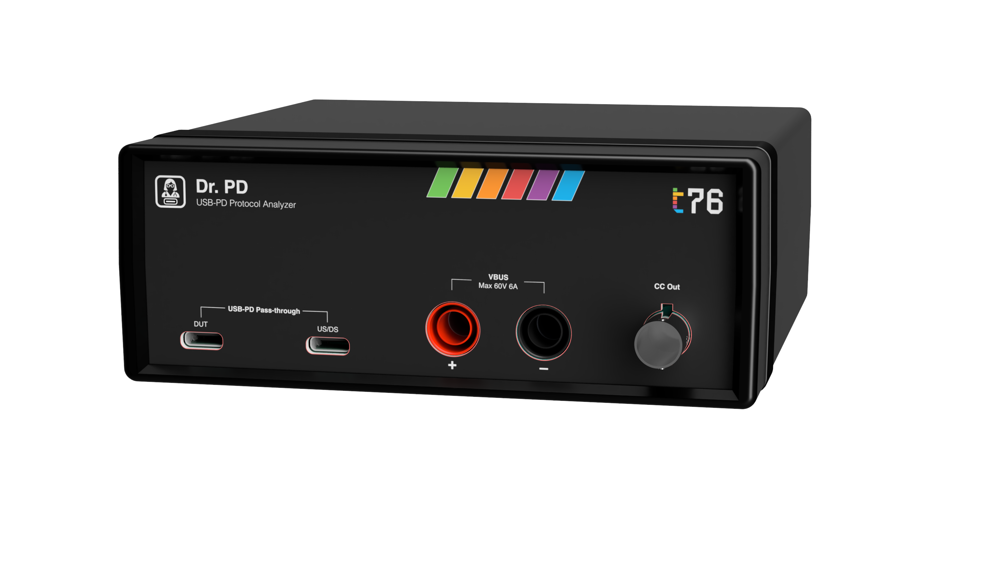

# Dr. PD - Open-source USB Power Delivery Analyzer and Programmable Sink

Dr. PD is a fuly-featured USB Power Delivery (USB-PD) analyzer and programmable sink. It is designed to help characterize and troubleshoot USB-PD devices like chargers, cables, and sink devices. 

**Dr. PD will be available for crowdfunding soon through Crowd Supply.** Visit our [prelaunch page](https://www.crowdsupply.com/t76-org/dr-pd) to sign up and receive updates on the project, including the crowdfunding launch.

## Features

Dr. PD can capture and decode USB-PD messages, measure voltage and current, and even emulate a USB-PD sink device to test chargers and cables under various conditions.

You can find out more about its features in the [online datasheet](./media/datasheet.md), but here are some important highlights:

### USB-PD protocol analysis

- Real-time message decoding with detailed protocol analysis
- Correlation of messages with VBUS voltage and current measurements
- Sophisticated search and trigger capabilities based on message types, device attach/detach events, power level changes, or external signals

### Programmable sink mode

- Emulate specific sink behavior, trigger faults, or test edge cases without a dedicated test fixture
- Analyze and test modern USB-PD implementations up to 48V / 5A / 240W with support for standard power delivery (SPR), extended power range (EPR), and programmable power supply modes (PPS/AVS)

### Software

- Real-time control software that runs in Chrome or Edge on Windows, macOS, Linux, and Android with no drivers or installation required
- First-class automation support with Python and JavaScript host libraries, plus support for industry-standard SCPI and USBTMC command interfaces
- Open-source hardware, firmware, and software with schematics and source code available on in this repo
- USB-PD stack implemented in firmware (instead of depending on a dedicated external chip) for maximum flexibility and updatability

## Project status

Dr. PD is currently undergoing device validation testing and will be available for crowdfunding soon through Crowd Supply. Visit our [prelaunch page](https://www.crowdsupply.com/t76-org/dr-pd) to sign up and receive updates on the project, including the crowdfunding launch.
