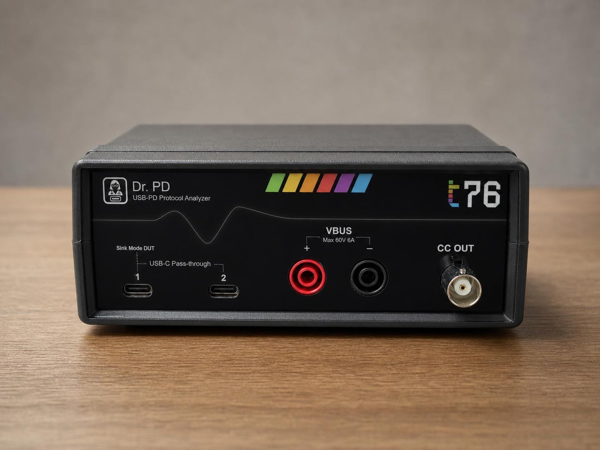
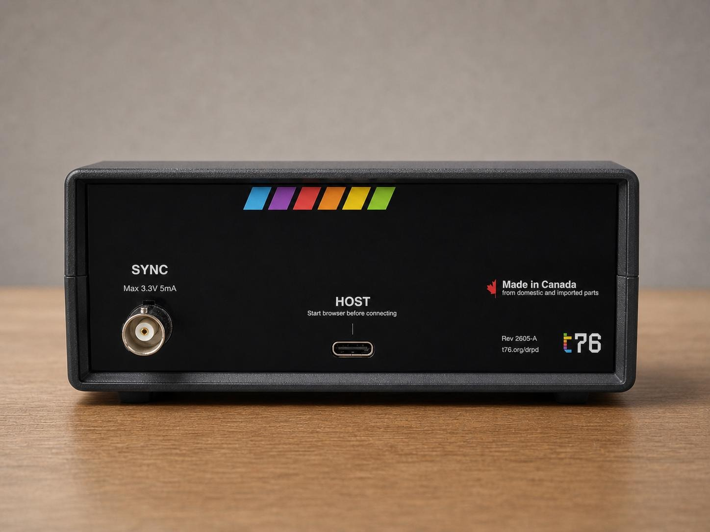
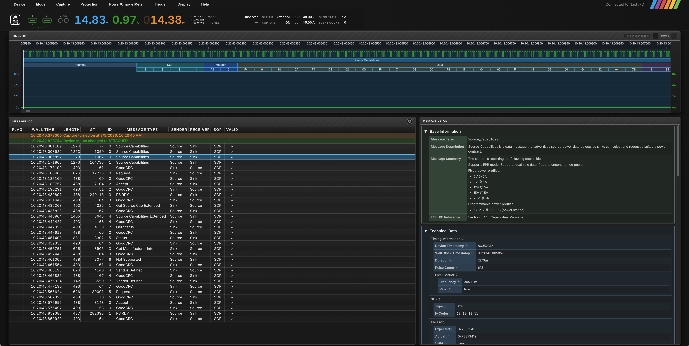
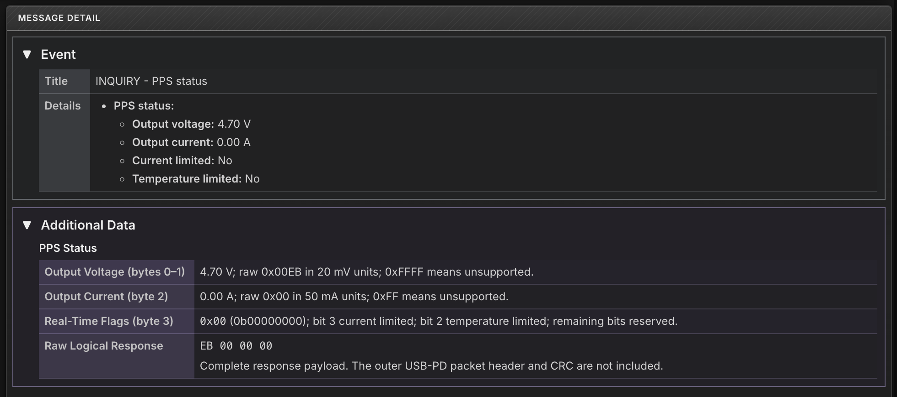
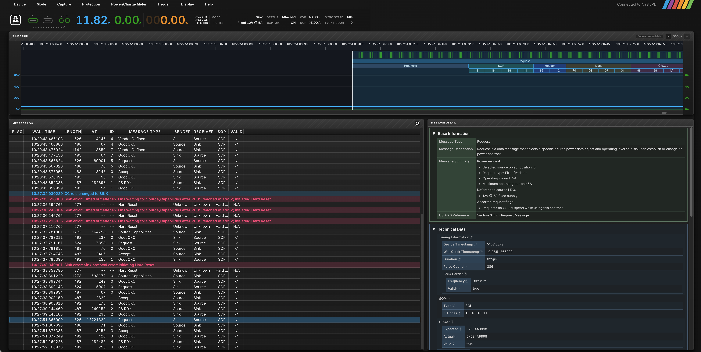

# Dr. PD - Open-source USB Power Delivery Analyzer and Programmable Sink

Dr. PD is a fully-featured USB Power Delivery (USB-PD) analyzer and programmable sink. It is designed to help characterize and troubleshoot USB-PD devices like chargers, cables, and sink devices. 

> [!NOTE]
> **Dr. PD will be available for crowdfunding soon through Crowd Supply.** Visit our [prelaunch page](https://www.crowdsupply.com/t76-org/dr-pd) to sign up and receive updates on the project, including the crowdfunding launch.

## Features

Dr. PD can capture and decode USB-PD messages, measure voltage and current, and even emulate a USB-PD sink device to test chargers and cables under various conditions.

You can find out more about its features in the [online datasheet](./media/datasheet.md), but here are some important highlights:

### USB-PD protocol analysis

- Real-time message decoding with detailed protocol analysis
- Correlation of messages with VBUS voltage and current measurements
- Sophisticated search and trigger capabilities based on message types, device attach/detach events, power level changes, or external signals

### Programmable sink mode

- Emulate specific sink behavior, trigger faults, or test edge cases without a dedicated test fixture
- Analyze and test modern USB-PD implementations **up to 48V / 5A / 240W** with support for standard power delivery (SPR), extended power range (EPR), and programmable power supply modes (PPS/AVS)

### Software

- Real-time control software that runs in Chrome or Edge on Windows, macOS, Linux, and Android with no drivers or installation required
- First-class automation support with Python and JavaScript host libraries, plus support for industry-standard SCPI and USBTMC command interfaces
- Open-source hardware, firmware, and software with schematics and source code available on in this repo
- USB-PD stack implemented in firmware (instead of depending on a dedicated external chip) for maximum flexibility and updatability

## Documentation

You can access the full documentation for Dr. PD [on the T76 website](https://t76.org/drpd/docs). The documentation includes a user manual, hardware and firmware design files, and software API references.

Downloadable hardware schematics in PDF and KiCAD format are available in the [hardware folder](./hardware) of this repository. The current hardware version is [R2605-A](./hardware/R2605-A).

**Interactive online schematics and PCB layout** are available in [the docs](https://t76.org/drpd/docs/category/internals), which also contain a detailed, step-by-step description of the hardware design.

## Screenshots

Click on the images below to view them in full size.

<table width="810">
  <tr>
    <td width="270" align="center"></td>
    <td width="270" align="center"></td>
    <td width="270" align="center"></td>
  </tr>
  <tr>
    <td width="270" align="left" valign="top"><strong>Front panel</strong></td>
    <td width="270" align="left" valign="top"><strong>Back panel</strong></td>
    <td width="270" align="left" valign="top">The <strong>Main interface</strong> runs in your browser and shows live analog measurement, message capture, and analysis.</td>
  </tr>
  <tr>
    <td width="270" align="center"></td>
    <td width="270" align="center"></td>
    <td width="270" align="center"></td>
  </tr>
  <tr>
    <td width="270" align="left" valign="top">The <strong>Message Detail</strong> breaks down each message into its constituent fields, timing data, CRC checks, and specification references.</td>
    <td width="270" align="left" valign="top">In <strong>Sink Mode</strong>, Dr. PD can interrogate the source by sending arbitrary messages to it.</td>
    <td width="270" align="left" valign="top"><strong>Source debugging:</strong> Dr. PD can correlate protocol traffic, electrical activity, errors, and recovery attempts to help troubleshoot connectivity between sources and sinks.</td>
  </tr>
  <tr>
    <td width="270" align="center"></td>
    <td width="270" align="center"></td>
    <td width="270" align="center"></td>
  </tr>
  <tr>
    <td width="270" align="left" valign="top"><strong>Response analysis:</strong> Here, Dr. PD has discovered that the connected source sent a non-compliant response.</td>
    <td width="270" align="left" valign="top"><strong>Message log filters</strong> Filter by message type, sender, receiver, SOP type, CRC, and flags.</td>
    <td width="270" align="left" valign="top"><strong>Capture trigger setup</strong> Trigger on protocol stages, message types, thresholds, or synchronized pulses.</td>
  </tr>
</table>

## Project status

Dr. PD is currently undergoing device validation testing and will be available for crowdfunding soon through Crowd Supply. Visit our [prelaunch page](https://www.crowdsupply.com/t76-org/dr-pd) to sign up and receive updates on the project, including the crowdfunding launch.
